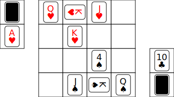
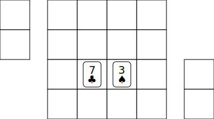
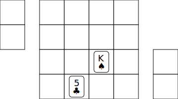
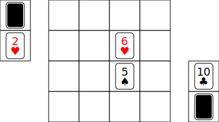
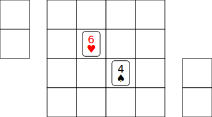
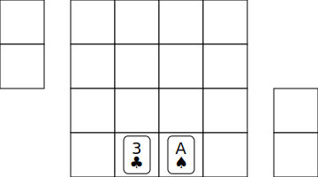

# ジョンの遊び方

---

## ゲームの名前
**ジョン**

---

## ゲームのジャンル
**トランプボードゲーム**

---

## 対象年齢とプレイ人数

- **2人専用**の戦略トランプボードゲームです。
- 小学生から大人まで、幅広い年齢層の方に楽しんでいただけます。

---

## プレイ時間の目安

- **1試合あたり10分から30分**ほどで決着がつきます。

---

## 使用するカード

- ジョーカーを抜いた**トランプ52枚**を使用します。
- このゲームでは、トランプのことを**ジョンカード**と呼びます。

---

## ゲームの概要

「ジョン」は、日本の伝統ゲームである**将棋**や、ファミコンの**シミュレーションRPGゲーム**に影響を受けて生まれた、戦略的で奥深いトランプゲームです。

4×4マスの限られた盤面で、プレイヤーは自分の「カード」を動かし、相手のカードと戦います。

ただ強いカードを出すだけでなく、計算された**戦略**で相手を追い詰めたり、伏せられたカードの中身を推測する**感覚**を研ぎ澄ませたり、相手の裏をかく**心理戦**を仕掛けたり…。様々な要素が勝利に繋がります。

さらに、トランプならではの**運**の要素も加わるため、毎回違う展開が楽しめ、**実力と運が勝利を左右するスリリングなゲーム**です。  
**1枚のカード、1つのマスが戦況を大きく変える、緊張感いっぱいの頭脳戦**をぜひ体験してみてください。

---

## 準備

さあ、ジョンを始める準備をしましょう！

---

### 1. 用意するもの

- トランプ52枚（ジョーカーは使いません）
- 対戦相手 1人
- ジョンボード（推奨）：4×4マスの盤面が描かれたボードがあるとカードの配置が分かりやすいですが、なくても遊べます。おおよそのマス目が分かれば大丈夫です。  

  

---

### 2. カードを分けよう！

- ジョーカーを抜いたトランプ52枚を、まず**赤色のカード**（ハートとダイヤ）と**黒色のカード**（スペードとクラブ）に分けます。
- これで、**赤の26枚、黒の26枚**の2つの山ができます。プレイヤーはそれぞれ1つずつ自分の山として持ちましょう。

---

### 3. 初期配置（はじめにカードを置こう！）

- 自分の26枚の山から、同じスートの**K（キング）、Q（クイーン）、J（ジャック）の絵札3枚**を抜き出します。
- これらの3枚を、盤面の自分の陣地の指定された位置に**縦向き**に置きます（図参照）。

  

- このとき、**Kだけは横向き**に置きます。この横向きに置いたKが、このゲームの**王様**にあたる大事なカードになります。このカードを「**横カード**」と呼びます。

  

---

### 4. 残りのカードの準備

- 絵札3枚を置いたら、手元に残った**23枚のカードをよくシャッフル**します。
- シャッフルした23枚を、**11枚ずつの2つの束**に分けましょう。
- 残った1枚のカードは、**横向きに置いたKの前のマスに置きます**。

  

---

### 5. 補充カードと変えカードを決めよう！

- 11枚の2つの束のうちの片方を、「**盤面外の一番手前に、裏向き**」に置いてください。これを「**補充カード**」(または「**張りカード**」)の山します。補充カードの中身は、ゲーム中に張るまで見てはいけません。
- もう片方の束を、「**補充カードの奥に、表向き**」に置いてください。これを「**変えカード**」の山とします。自分の変えカードの中身は、ゲーム開始後であればいつでも確認できます、常に手に持ってプレイしても構いません。

  

- これで準備は完了です！**ジャンケンなどで先攻・後攻を決めて、ゲームを開始しましょう！**

---

## ゲームの目的

このゲームの目的は、**相手の横カード（最初に横向きに置いたKカード）を倒すこと**です。

---

## ゲームの進行方法

ジョンは、将棋のようにお互いに**1手ずつ交互に手番**を行うゲームです。  
手番では、以下の**3つのアクションのうち、どれか1つ**を選んで実行します。

- **移動**：盤面上の自分のカードを動かします。
- **補充**：自分の補充カードの山から新しいカードを盤面に出します。
- **特殊能力**：特定の特殊カードの能力を使います。

---

### 1. 移動（カードを動かそう！）

ルールに従って、盤面上の自分のカードを動かすことができます。

- **数字札（A～10）**：上下左右に1マス移動できます。

  

- **絵札（J、Q、K）**：上下左右に加えて、斜めにも1マス移動できます（将棋の王将と同じ動きです）。  

  
    
  **ポイント**：横カード（最初に横向きに置いたKカード）が相手の攻撃を受けて数字札に変わった場合、移動のルールは数字札と同じになります（斜めには動けません）。

- **カードの「入れ替え」**：自分のカードが移動できる範囲に、他の自分のカードがある場合、その2枚の位置を入れ替えることができます。

   1/2
   2/2

  入れ替える2枚のうち、どちらか1枚でも絵札なら、斜め方向にも入れ替えることができます。  

   1/2
   2/2

---

### 2. 補充（新しいカードを盤面に出そう！）

自分の補充カードの山からカードを1枚取り、盤面内の自分の陣地（4✕4マスの半分より手前側）にある**空いている場所に、表向き**に置くことができます。

- **補充カードは全部で11枚**です。すべて使い切ると、それ以上カードを張ることはできません。

---

### 3. 攻撃（相手のカードを倒そう！）

自分のカードの移動できる範囲に相手のカードがいる場合、その相手のカードに**攻撃**を仕掛けることができます。

- **カードの「パワー(強さ)」と「HP（体力）」**：  
ジョンでは、カードのランク(数字)がそのまま「パワー」と「HP」を表します。  
**Aは1、Jは11、Qは12、Kは13**と数えます。Aが最も弱いランクのカードで、Kが最も強いランクのカードです。

- **攻撃の進め方：**

  1. まず、攻撃する自分のカードと、攻撃される相手のカードの場所を「**入れ替え**」ます。
  2. 次に、相手のカードにダメージを与えます。  
    攻撃ダメージは、「**攻撃を受けるカードのHP － 攻撃するカードのパワー**」で計算します。

     >例：相手の♥5（HP5）に、あなたの♠6（パワー6）が攻撃した場合、計算は「5－6」となり、相手の♥5のHPはなくなります。  

       1/3
       2/3
       3/3

  3. ダメージを受けた相手のカードの処理をします。
     - **相手のカードのHPが0以下になった場合**：  
     相手のカードは「倒された」ことになり、相手の変えカードの山に加えます。手番は相手に移ります。

     - **相手のカードのHPが残った場合**：  
     相手のカードは「ダメージを受けた」ことになり、相手の変えカードの山に加わります。そして相手は、その山からダメージ計算後のランクとなるカードを引き出し、元の位置に置きます。カードのスートは問いません。　　

       >例：相手の♥6(HP6)のカードに、自分の♠5(パワー5)のカードが攻撃して「6-5=1」となった場合、♥6のカードを相手の変えカードの山に加えて、相手は代わりにA（HP1）のカードを引き出し、盤面に置きます。 

         1/3
         2/3
         3/3

        もし、変えカードの山にダメージ計算後のランクとなるカードがない場合は、そのカードが見つかるまで1つづつランクを下げて探して、引き出してください。もしAのカードを引き出したいのに変えカードにAがない場合は、そのカードは「倒された」ことになるので、手番は相手に移ります。

          - **相手カードからの反撃**

            攻撃を受けた相手のカードが倒されなかった場合は、相手は必ず**反撃**してきます。  
            反撃のダメージは、「**反撃を受けるカードのHP － 反撃するカードがダメージを受ける前のパワー**」で計算します。  
            反撃ダメージを受けた自分のカードは自分の変えカードの山に加え、手番は相手に移ります。反撃は手番としてカウントしません。

            
      
      

---

### 4. 特殊能力（特殊カードを使おう！）

ジョンには、まるでRPGの僧侶や魔法使いのように、特別な力を持つ「**特殊カード**」が2種類あります。

---

#### 「4」のカード（遠距離攻撃型）

- **遠距離攻撃**：  
4のカードは、**2マス以内**の相手のカード1枚に対して遠距離攻撃を使うことができます。

   

- **相手カードのランクを半分に！**：  
  この特殊能力は、相手のカードのランクを**半分**にします。  

   1/2
   2/2
  
- **半分にして小数点が出たら切り捨て**：  
  半分にした時に小数点が出たら、その小数点以下は**切り捨て**ます（例：K（13）は6に、9は4に、5は2になります）。　

- **遠距離攻撃のやり方**：   
  まず、4の遠距離攻撃をどの相手カードに対して行うのかを宣言してください。  
  相手のカードは「遠距離攻撃を受けた」ことになり、相手の変えカードの山に加わります。代わりに半減後のランクとなるカードを引き出し、同じ位置に置いてください。  
  
  変えカードの山に半減後のランクとなるカードがない場合は、そのカードが見つかるまで1つづつランクを下げて探して、引き出してください。Aのカードを引き出したいのに変えカードにAがない場合は、そのカードは「倒された」ことになります。カードのスートは問いません。

- **大切なルール**：  
  この能力はその場から行う能力です。攻撃と違い、**相手からの反撃は受けません**。

---

#### 「A」のカード（回復型）

- **味方のカードを2倍に！**：  
自分のAのカードと他の自分のカードを「入れ替え」する際、Aのカードは入れ替えたカードのランクを**2倍**に回復させることができます。

   1/2
   2/2

- **回復の上限は「10」まで**：  
どんなランクでも、回復後のランクは10が上限です（例：Aは2に、3は6に、7は10になります）。

- **回復のやり方**：  
  通常の「入れ替え」の後、Aのカードで回復するカードを自分の変えカードの山に加えて、代わりに回復後のランクとなるカードを引き出し、同じ位置に置いてください。  

  自分の変えカードの山に回復後のランクとなるカードがない場合は、そのカードが見つかるまで1つづつランクを下げて探して、引き出してください。カードのスートは問いません。

- **大切なルール**：  
自分のAカード自体、相手のカード、そして絵札（J、Q、K）のランクを回復することはできません。

---

## 勝利条件

**相手の「横カード」（最初に横向きに置いたKカード）を倒したプレイヤーの勝利です！**

---

## ルールと注意点

### 横カード

- 横カードは、**攻撃を受けても特殊能力を受けても、常に横の表示のまま**です。たとえカードのランクが変化した場合でも、横向きのまま盤面に残ります。

### ループ（千日手）

- 盤面上の状態が、全く同じ局面を**3回繰り返した場合**、「ループ」という状態になります。
- ループになったら、同じ局面を繰り返さないように、補充カードが多い方のプレイヤーが**3手番以内**に別の手を出してループを解消しなければなりません。
- もし補充カードの枚数が同じ場合は、盤面に出ている自分のカードの**枚数が多いプレイヤー**がループを解消します。それも同じ場合は、盤面に出ている自分のカードの**ランクの合計が高いプレイヤー**がループを解消します。
- これらすべてが同じ場合は、その試合は「**引き分け**」となります。
- ループを解消すべきプレイヤーが3手番以内に解消できなかった場合、そのプレイヤーの**反則負け**となります。

---

### パスはできない

- 自分の手番では、**必ず何らかのアクション（移動、補充、特殊能力のどれか）を行わなければなりません。パスはできません。**

---

### 変えカードの置き方について

- ゲーム開始までは、変えカードは原則として**表を上に向けて**ボードに置いておきましょう。
- 変えカードの山の**一番上のカードは、相手からも見える状態**になります。これは、お互いのカード内容を予測するための「ヒント」として、ジョンの戦略的な要素の一つとなります。
- 自分の変えカードの山の中身は、**いつでも手に取って確認できます。**

---

## よくある質問

### 「ジョン」って何が面白いの？

- **カードの組み合わせ**：弱いランクのカードでも、組み合わせ次第で想像以上に強力なカードになります（例えば、Aと2を組み合わせて、遠距離攻撃ができる強力な4のカードを作るなど）。また、特定のカード（例：4）に対して強いカード（例：8や9）もあるので、いろいろ試して戦術を見つけるのも楽しいでしょう。
- **まさかの展開**：補充カードの山や変えカードの山から、思わぬカードが出てくることがよくあります。これにより、一気に形勢が逆転したり、大ピンチを切り抜けたりと、ハラハラドキドキの展開が生まれます。
- **奥深い心理戦**：補充カードから新しいカードを引くときのワクワク感や、変えカードの中身を気にしながら戦略を練る緊張感、そして相手の手を読み合う楽しさは、ジョンならではの大きな魅力です。

---

### ジョンボードがないと遊べないの？

- **いいえ、そんなことはありません！**  
ジョンはトランプさえあれば、どこでも遊べるように開発されています。マス目が描かれていないところでも、4×4マスの位置がおおよそ分かれば十分プレイできますし、最初のカード配置は、そのマス目の目安にもなるでしょう。

---

### Aカードで回復した時に、目的のカードが変えカードになかったらどうなるの？

- **ご安心ください！**  
Aカードで回復させる時、回復するカードを一度自分の変えカードに加えてから、回復後のカードを探します。そのため回復後のカードが変えカード内になかったとしても、元のランクのカードは変えカード内に入っているはずなので、ランクが下がることは絶対にありません。

---