# ジョン（JOHN）説明書

## ゲームの名前
**ジョン（JOHN）**

---

## ゲームのジャンル
**トランプボードゲーム**

---

## 対象年齢とプレイ人数

- **2人対戦**の戦略トランプボードゲームです。
- 小学生から大人まで、だれでも楽しく遊べます。

---

## プレイ時間の目安

- **1試合は10分から30分**くらいで終わります。

---

## 使用するカード

- ジョーカーを抜いた**トランプ52枚**を使います。
- このゲームでは、トランプのことを**ジョンカード**と呼びます。

---

## ゲームの概要

「ジョン」は、日本の**将棋**や、ファミコンの**シミュレーションRPG**に似た、駆け引きを楽しむ戦略トランプゲームです。

4×4マスの小さなマスで、自分の「カード」を動かして、相手のカードと戦います。

勝ち負けを決めるのはカードの強さだけではなく、**作戦**を考えて、ふせたカードの中身を読み、相手の裏をかく**心理戦**が重要です。

さらに、トランプ特有の**運の要素**が絡むことで、毎回異なる展開になります。  
**1枚のカード、1つのマスが勝負を大きく変える、手に汗にぎる頭脳バトル**をぜひ体験してみてください。

---

## 準備

さあ、ジョンを始める準備をしましょう！

---

### 1. 用意するもの

- トランプ：52枚（ジョーカーは使いません）
- プレイヤー人数：2人
- ジョンボード（おすすめ）：4×4マスが分かるボードがあると遊びやすいですが、なくても大丈夫です。マス目がだいたい分かればOKです。マス外に補充カード・変えカード置き場があれば、もっと遊びやすいです。(図1)  

  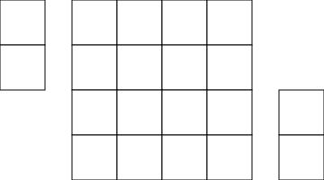 図1

---

### 2. カードを分けよう！

- ジョーカーを抜いたトランプ52枚を、**赤色のカード**（ハートとダイヤ）と**黒色のカード**（スペードとクラブ）に分けます。
- これで、**赤26枚、黒26枚**の2つの山ができます。プレイヤーはそれぞれ1つずつ自分の山として持ちます。

---

### 3. 初期配置（はじめにカードを置こう！）

- 自分の26枚の山から、同じマークの**K、Q、J**の3枚を出します。
- この3枚を、自分の陣地（マスの横半分より手前）の決まった場所に、**たて向き**に置きます。(図2)  

  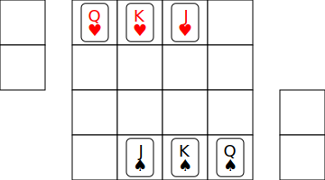 図2

- このとき、**Kだけは横向き**に置きます。この横向きのKが、このゲームの**王様**です。このカードを「**横カード**」と呼びます。(図3)  

  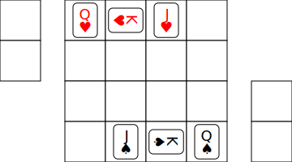 図3

---

### 4. 残りのカードの準備

- 手元に残った**23枚のカードをよくシャッフル**します。
- シャッフルした23枚を、**11枚ずつの2つの束**に分けます。
- 残った1枚のカードは、**横向きに置いたKの前のマスに置きます**。(図4)    

  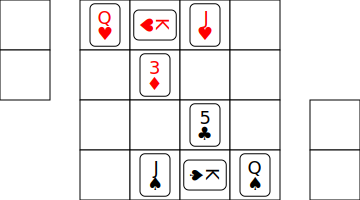 図4

---

### 5. 補充カードと変えカードを決めよう！

- 11枚の束のうち1つを、「**マスの外の手前に、うら向き**」に置きます。  
これが「**補充カード**」の山になります。補充カードの中身は、ゲーム中に使うまで見てはいけません。(補充カードは「**張りカード**」と呼ぶこともあります)
- もう1つの束を、「**補充カードの奥に、おもて向き**」に置きます。  
これが「**変えカード**」の山になります。ゲームが始まったら、自分の変えカードの中身はいつ見てもOKです。また、ずっと手に持ってプレイしても構いません。  

- これで準備は完了です。  
**ジャンケンなどで先攻・後攻を決めて、ゲームを始めましょう！**(図5)

  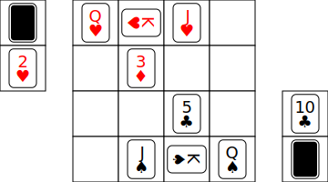 図5  

---

## ゲームの目的

このゲームの目的は、**相手の横カード（最初に横向きに置いたKカード）を倒すこと**です。

---

## ゲームの進め方

ジョンは、将棋のように**1手ずつ交代で手番**をします。  
手番では、**4つのアクションのうち、どれか1つ**を選んで行います。

- **移動**：マス上の自分のカードを動かします。
- **攻撃**：マス上の自分のカードで相手のカードを攻撃します。
- **補充**：自分の補充カードの山から新しいカードを自分の陣地に出します。
- **特殊能力**：特別なカードの力を使います。

---

### 1. 移動（カードを動かそう！）

ルールにそって、マス上の自分のカードを動かせます。

- **数字札（A～10）**：上下左右に1マス動くことができます。(図6)  

   図6

- **絵札（J、Q、K）**：上下左右とななめ方向に1マス動くことができます（将棋の王様と同じ動きです）。(図7)  

  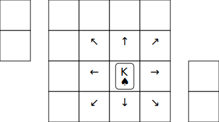 図7

- **カードの「入れかえ」**：自分のカードが動ける場所に、ほかの自分のカードがあるとき、その2枚の場所を入れかえられます。(図8-1～2)  

  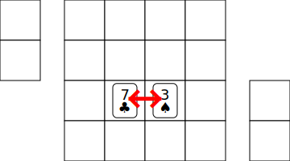  図8-1  
  
  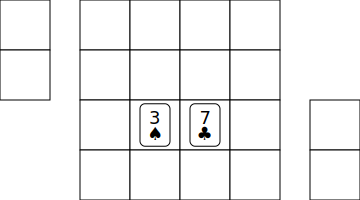  図8-2  

  入れかえる2枚のうち、どちらか1枚でも絵札なら、ななめにも入れかえられます。(図9-1～2)  

  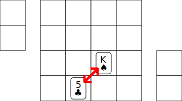 図9-1  
  
  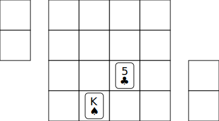 図9-2  

---

### 2. 攻撃（相手のカードを倒そう！）

自分のカードの動ける場所に相手のカードがいるとき、その相手のカードに**攻撃**できます。

- **カードの「パワー（強さ）」と「HP（体力）」**：  
ジョンでは、カードの数字がそのまま「パワー」と「HP」になります。  
**Aは1、Jは11、Qは12、Kは13**です。  
この数字を「**ランク**」と呼び、Aが一番弱く、Kが一番強いランクのカードです。  

- **攻撃のやり方：**

  1. まず、攻撃する自分のカードと、攻撃される相手のカードの場所を「**入れかえ**」ます。
  2. 次に、相手のカードにダメージを与えます。  
     ダメージは、「**相手のカードのHP － 自分のカードのパワー**」で計算します。

     >例：相手の♥5（HP5）に、あなたの♠6（パワー6）が攻撃した場合(図10-1～2)、「5－6」となり、相手の♥5のHPは0以下になるので倒されます。(図10-3)

      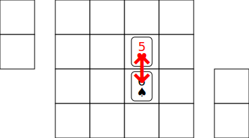 図10-1  
  
      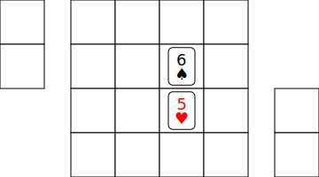 図10-2  
  
      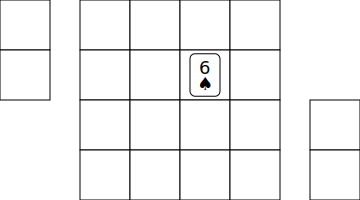 図10-3  
    
      このダメージ計算で、**相手のカードのHPが0以下になった場合**、そのカードは「倒された」ことになり、相手の変えカードの山に加えます。手番は相手にうつります。

  3. ダメージ計算の結果、**相手のカードのHPが残った場合**は、次の処理を行います。

     このとき、相手のカードは「ダメージを受けた」ことになり、相手の変えカードの山に加えます。そして相手は、その山からダメージ計算後のランクのカードを引き出して、同じマスに置きます。カードのマークは何でもOKです。

     >例：相手の♥6（HP6）のカードに、自分の♠5（パワー5）のカードが攻撃した場合(図11-1～2)、「6-5=1」となり、♥6のカードを相手の変えカードの山に加え(図11-3)、相手はその山からA（HP1）のカードを引き出して同じマスに置きます。(図11-4)

        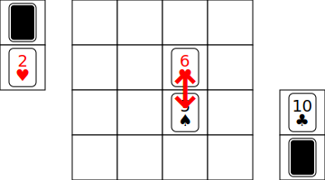 図11-1  
  
         図11-2  
  
        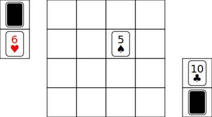 図11-3  
  
        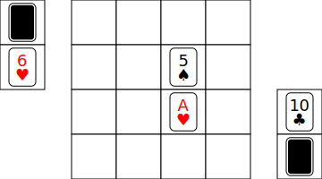 図11-4  

     もし、変えカードの山にダメージ計算後のランクのカードがない場合は、そのカードが見つかるまで1つずつランクを下げて探し、引き出してください。この時、Aのランクのカードを出したいのに変えカードの山にAがない場合は、そのカードは「倒された」ことになり(図12)、手番は相手にうつります。

      図12  

  4. **攻撃を受けても倒されなかった相手カードは反撃します。**

     攻撃を受けた相手のカードが倒されなかった場合は、相手は必ず「**反撃**」をしてきます。  
     反撃のダメージは、「**反撃を受けるカードのHP － 反撃するカードがダメージを受ける『前』のパワー**」で計算します。  
     反撃ダメージを受けた自分のカードは自分の変えカードの山に加え(図13)、手番は相手にうつります。「反撃」は手番として数えません。

     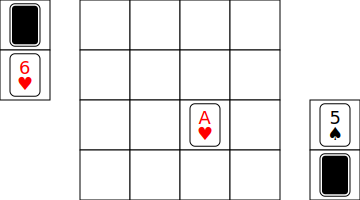 図13  

---

### 3. 補充（新しいカードをマスに出そう！）

自分の補充カードの山の上から1枚カードをとり、自分の陣地（マスの横半分より手前）にある**空いているマスに、おもて向き**にして置くことができます。

- **補充カードは全部で11枚**です。全部使ったら、それ以上出すことはできません。
- 横向きに置く(横カードとして置く)ことはできません。

---

### 4. 特殊能力（特別なカードを使おう！）

ジョンには、RPGの魔法使いや僧侶のように、特別な力を持つカードが2種類あります。

#### 「4」のカード（魔法能力）

- **魔法能力**：  
4のカードは、そのマスから**2マス以内**の相手のカード1枚に魔法による効果を与えることができます。(図14)  

  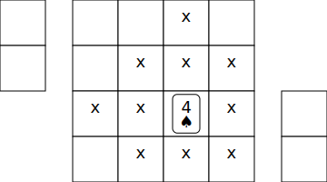 図14  

- **相手カードのランクを半分に！**：  
  この能力を使うと、相手のカードのランクを**半分**にします。(図15-1～2)  

  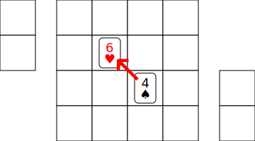 図15-1  
  
  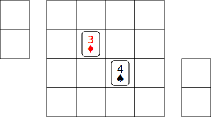 図15-2  
  
- **半分にして小数点が出たら切り捨て**：  
  相手のカードのランクを半分にすることで小数点が出たら、下の数に切り捨てます（例：Kは6に、9は4に、5は2になります）。

- **魔法能力の使い方**：   
  まず、4の魔法効果を相手のどのカードに与えるかを言ってください。  
  相手のカードは「魔法効果を受けた」ことになり、相手の変えカードの山に加えます。かわりに半分になったランクのカードを引き出して、同じマスに置きます。  

  相手の変えカードの山に半分になったランクのカードがない場合は、相手はそのカードが見つかるまで1つずつランクを下げて探して、引き出してください。Aのランクのカードを出したいのに変えカードにAがない場合は、そのカードは「倒された」ことになります。カードのマークは何でもOKです。

- **大事なルール**：  
  この能力はその場から使えます。攻撃と違い、**相手からの反撃はありません**。

#### 「A」のカード（回復能力）

- **味方のカードランクを2倍に！**：  
自分のAのカードとほかの自分のカードを「入れかえ」するとき、Aのカードは入れかえたカードのランクを**2倍**に回復することができます。(図16-1～2)  

  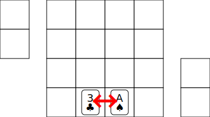 図16-1  

  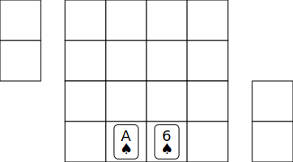 図16-2  

- **回復の上限は「10」まで**：  
どんなランクでも、回復した後のランクは10が上限です（例：Aは2に、3は6に、7は10になります）。

- **回復のやり方**：  
  ふつうの「入れかえ」移動の後、Aのカードで回復するカードを自分の変えカードの山に加えて、かわりに回復後のランクのカードを引き出して、同じマスに置きます。

  自分の変えカードの山に回復後のランクのカードがない場合は、そのカードが見つかるまで1つずつランクを下げて探して、引き出してください。カードのマークは何でもOKです。

- **大事なルール**：  
自分のAカード自体、相手のカード、そして絵札（J、Q、K）のランクは回復できません。

---

## 勝利条件

**相手の「横カード」（最初に横向きに置いたKカード）を倒した人の勝ちです！**

---

## ルールと注意点

### 横カード

- 横カードは、**移動をしても、攻撃や特殊能力を受けても**、ずっと横向きのままマス内に残ります。  
- 横カードが攻撃や特殊能力を受け、絵札から数字札に変わった場合は、数字札と同じ動きになります（ななめには動けません）。

### ループ（将棋でいう千日手）

- マスの状態が、まったく同じ場面を**3回くり返したとき**、「**ループ**」になります。  
ループになったら、同じ場面をくり返さないように、「**補充カード**」が多い方が**3手番以内**にちがう手を出してループを終わらせないといけません。  
もし補充カードの数が同じ場合は、マスに出ている「**カード枚数が多いプレイヤー**」が、それも同じなら、マスに出ている「カード**ランクの合計が多いプレイヤー**」がループを終わらせる手を出してください。  
これらがすべて同じなら、その試合は、先攻の**反則負け**となります。

---

### パスはできない

- 自分の手番では、**必ず何かアクション（移動、攻撃、補充、特殊能力のどれか）をしないといけません。パスはできません。**

---

## よくある質問

### 「ジョン」って何が面白いの？

- **カードの組み合わせ**  
弱いカードでも、組み合わせしだいで強くなります（たとえば、Aと2を組み合わせて、魔法攻撃できる4のカードを作るなど）。また、特定のカード（例：4）に強いカード（例：8や9）もあるので、いろいろ試して作戦を考えるのも楽しいです。
- **まさかの展開**  
補充カードや変えカードから、思いがけないカードが出てきます。これで、一気に形勢が逆転したり、ピンチを切りぬけたりと、ドキドキの展開が生まれます。
- **深い心理戦**  
補充カードから新しいカードを出すときのワクワク感や、変えカードの中身を気にしながら作戦を考えるドキドキ、そして相手の手を読み合う楽しさは、ジョンならではの大きな魅力です。

---

### ジョンボードがないと遊べないの？

- **いいえ、そんなことはありません！**  
ジョンはトランプさえあれば、どこでも遊べます。マス目がなくても、4×4マスの場所がだいたい分かれば十分です。最初のカードの置き方は、そのマス目を分かりやすくする目安にもなっています。

---

### Aカードで回復した時に、目的のカードが変えカードになかったらどうなるの？

- **ご安心ください！**  
Aカードで回復するとき、回復するカードを一度自分の変えカードに加えてから、回復後のカードを探します。だから回復後のカードが変えカードにない場合でも、元のランクのカードは変えカードに入っているので、それ以上ランクが下がることはありません。

---

### 変えカードからカードを出すときに、本当はあるカードを「ない」と言って、ランクを下げて出すことはできるの？

- **実は、ジョンにはこのような“ズル”ができてしまう弱点があります。**  
  変えカードからカードを出すとき、本当はあるカードを「ない」と言って、ランクを下げて出すこともできてしまいます。でも、ジョンはお互いの信用（しんよう）で成り立つゲームです。ズルをしないで正しく遊びましょう。

-  **この弱点をなくすための「アルティメットルール」というルールもあります！**  
もし「本当はそのカードがあるのに、ないと言ってランクを下げて出したかも？」と思ったら、「ダウト！」と言って相手の変えカードをすべて見せてもらいましょう。本当にそのカードがなかったらダウトと言われた人の負けで、そのカードがあったらダウトといった人の負けです。この「アルティメットルール」を使うことで、さらにスリリングで奥深いゲームになることでしょう。